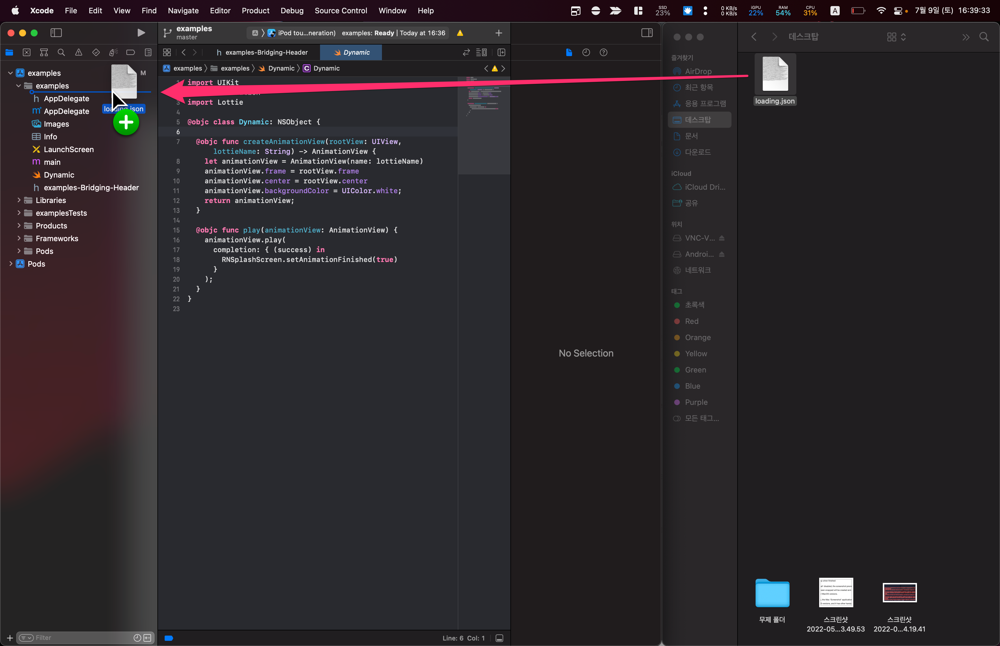
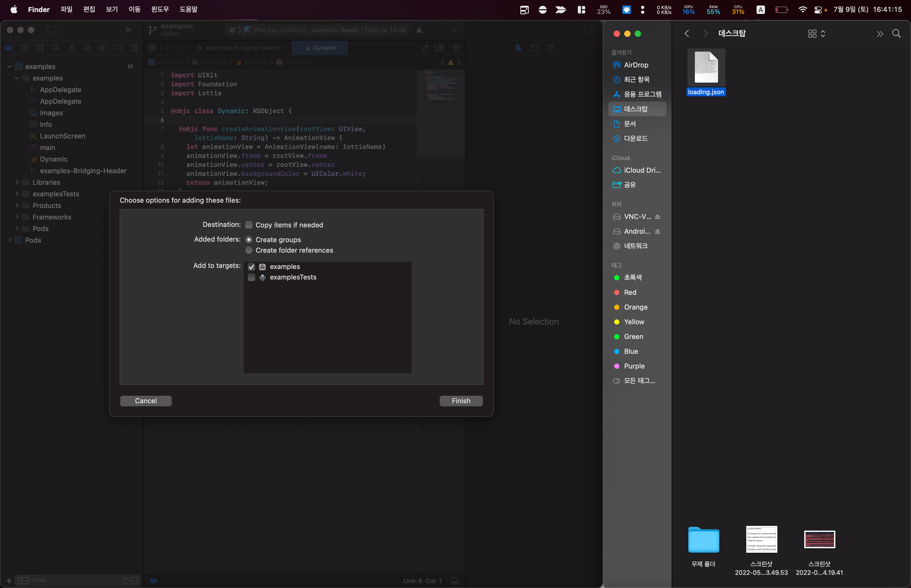

# react-native-lottie-splash-screen

[ ](https://www.npmjs.com/package/react-native-lottie-splash-screen)
[ ](https://github.com/HwangTaehyun/react-native-lottie-splash-screen/pulls)
[ ](https://github.com/crazycodeboy/GitHubPopular/releases)
[](https://raw.githubusercontent.com/crazycodeboy/react-native-check-box/master/LICENSE)

Fork of [react-native-splash-screen](https://github.com/crazycodeboy/react-native-splash-screen) and add implement for animation splash screen using airbnb lottie files.

Works on IOS and Android.

## Content

- [Examples](#examples)
- [Installation](#installation)
- [Getting started](#getting-started)
- [API](#api)
- [Contribution](#contribution)

## Examples

You can run [examples](https://github.com/HwangTaehyun/react-native-lottie-splash-screen/tree/master/examples) in this project


## Installation

### First step(Download):

Run `yarn add lottie-ios@3.2.3 react-native-lottie-splash-screen`

### Second step(Plugin Installation):

### React Native v0.60+

The package is [automatically linked](https://github.com/react-native-community/cli/blob/master/docs/autolinking.md) when building the app. All you need to do is:

```bash
cd ios && pod install
```

For android, the package will be linked automatically on build.

<details>
 <summary>For React Native version 0.59 or older</summary>

### React Native <= v0.59

```bash
react-native link react-native-lottie-splash-screen
```

If you don't want to use the methods above, you can always do Manual installation.

</details>

### Manual installation

**Android:**

1. In your `android/settings.gradle` file, make the following additions:

```java
include ':react-native-lottie-splash-screen'
project(':react-native-lottie-splash-screen').projectDir = new File(rootProject.projectDir, '../node_modules/react-native-lottie-splash-screen/android')
```

2. In your android/app/build.gradle file, add the `:react-native-lottie-splash-screen` project as a compile-time dependency:

```java
...
dependencies {
    ...
    implementation project(':react-native-lottie-splash-screen')
}
```

3. Update the MainApplication.java file to use `react-native-lottie-splash-screen` via the following changes:

```java
// react-native-lottie-splash-screen >= 0.3.1
import org.devio.rn.splashscreen.SplashScreenReactPackage;
// react-native-lottie-splash-screen < 0.3.1
import com.cboy.rn.splashscreen.SplashScreenReactPackage;

public class MainApplication extends Application implements ReactApplication {

    private final ReactNativeHost mReactNativeHost = new ReactNativeHost(this) {
        @Override
        public boolean getUseDeveloperSupport() {
            return BuildConfig.DEBUG;
        }

        @Override
        protected List<ReactPackage> getPackages() {
            return Arrays.<ReactPackage>asList(
                    new MainReactPackage(),
            new SplashScreenReactPackage()  //here
            );
        }
    };

    @Override
    public ReactNativeHost getReactNativeHost() {
        return mReactNativeHost;
    }
}
```

**iOS:**

1. `cd ios`
2. `run pod install`

> OR

1. In XCode, in the project navigator, right click `Libraries` ➜ `Add Files to [your project's name]`
2. Go to `node_modules` ➜ `react-native-lottie-splash-screen` and add `SplashScreen.xcodeproj`
3. In XCode, in the project navigator, select your project. Add `libSplashScreen.a` to your project's `Build Phases` ➜ `Link Binary With Libraries`
4. To fix `'RNSplashScreen.h' file not found`, you have to select your project → Build Settings → Search Paths → Header Search Paths to add:

   `$(SRCROOT)/../node_modules/react-native-lottie-splash-screen/ios`

### Third step(Plugin Configuration):

**Android:**

Update the `MainActivity.java` to use `react-native-lottie-splash-screen` via the following changes:

```java
import android.os.Bundle;
import com.facebook.react.ReactActivity;
import org.devio.rn.splashscreen.SplashScreen; // here
import android.os.Bundle;

public class MainActivity extends ReactActivity {
  @Override
  protected void onCreate(Bundle savedInstanceState) {
    SplashScreen.show(this, R.id.lottie); // here
    SplashScreen.setAnimationFinished(true); // If you want the animation dialog to be forced to close when hide is called, use this code
    super.onCreate(savedInstanceState);
    // ...other code
  }
}
```

**iOS:**

1. Create `Dynamic.Swift` with the following contents:

```swift
import UIKit
import Foundation
import Lottie

@objc class Dynamic: NSObject {

  @objc func createAnimationView(rootView: UIView, lottieName: String) -> AnimationView {
    let animationView = AnimationView(name: lottieName)
    animationView.frame = rootView.frame
    animationView.center = rootView.center
    animationView.backgroundColor = UIColor.white;
    return animationView;
  }

  @objc func play(animationView: AnimationView) {
    animationView.play(
      completion: { (success) in
        RNSplashScreen.setAnimationFinished(true)
      }
    );
  }
}
```

2. Create `[your-project-name]-Bridging-Header.h` with the following contents:

```objc
//  HyperMoney-Bridging-Header.h

#ifndef HyperMoney_Bridging_Header_h
#define HyperMoney_Bridging_Header_h

#import "RNSplashScreen.h" // here

#endif /* HyperMoney_Bridging_Header_h */

```

3. To use swift file in AppDelegate.m, follow next step.

[https://developer.apple.com/documentation/swift/imported_c_and_objective-c_apis/importing_swift_into_objective-c](https://developer.apple.com/documentation/swift/imported_c_and_objective-c_apis/importing_swift_into_objective-c)

> Import Swift code into Objective-C within the same framework:\
> \
> Under Build Settings, in Packaging, make sure the Defines Module setting for that framework target is set to Yes.\
> \
> Import the Swift code from that framework target into any Objective-C .m file within that target using this syntax and substituting the appropriate names:

4. Update `AppDelegate.m` with the following additions:

```obj-c

#import "AppDelegate.h"

#import <React/RCTBridge.h>
#import <React/RCTBundleURLProvider.h>
#import <React/RCTRootView.h>
#import "RNSplashScreen.h" // here

#import "HyperMoney-Swift.h" // here, change project name to yours

@implementation AppDelegate

- (BOOL)application:(UIApplication *)application didFinishLaunchingWithOptions:(NSDictionary *)launchOptions
{

  // ...other code

  /* here */
  UIViewController *rootViewController = [UIViewController new];

  rootViewController.view = rootView;

  self.window.rootViewController = rootViewController;
  [self.window makeKeyAndVisible];

  Dynamic *t = [Dynamic new];
  UIView *animationUIView = (UIView *)[t createAnimationViewWithRootView:rootView lottieName:@"loading"]; // change lottieName to your lottie files name
  animationUIView.backgroundColor = [UIColor whiteColor]; // change backgroundColor

  // register LottieSplashScreen to RNSplashScreen
  [RNSplashScreen showLottieSplash:animationUIView inRootView:rootView];

  // casting UIView type to AnimationView type
  AnimationView *animationView = (AnimationView *) animationUIView;

  // play
  [t playWithAnimationView:animationView];

  // If you want the animation layout to be forced to remove when hide is called, use this code
  [RNSplashScreen setAnimationFinished:true];

  /* here */

  return YES;
}
```

## Getting started

Import `react-native-lottie-splash-screen` in your JS file.

`import SplashScreen from 'react-native-lottie-splash-screen'`

### Android:

Create a file called `launch_screen.xml` in `app/src/main/res/layout` (create the `layout`-folder if it doesn't exist). Next, locate your lottie files in `app/src/main/res/raw` (loading.json in this example). The contents of the file should be the following:

```xml
<?xml version="1.0" encoding="utf-8"?>
<LinearLayout xmlns:android="http://schemas.android.com/apk/res/android"
    xmlns:app="http://schemas.android.com/apk/res-auto"
    xmlns:tools="http://schemas.android.com/tools"
    tools:context=".MainActivity"
    android:orientation="vertical"
    android:layout_width="match_parent"
    android:layout_height="match_parent"
    android:background="@color/white"
  >
    <com.airbnb.lottie.LottieAnimationView
        android:id="@+id/lottie"
        android:layout_width="match_parent"
        android:layout_height="match_parent"
        app:lottie_rawRes="@raw/loading"
        app:lottie_autoPlay="true"
        app:lottie_loop="false"
        />
</LinearLayout>
```

Customize your launch screen by creating a `launch_screen.png`-file and placing it in an appropriate `drawable`-folder. Android automatically scales drawable, so you do not necessarily need to provide images for all phone densities.
You can create splash screens in the following folders:

- `drawable-ldpi`
- `drawable-mdpi`
- `drawable-hdpi`
- `drawable-xhdpi`
- `drawable-xxhdpi`
- `drawable-xxxhdpi`

### iOS

Drag your lottie files to Xcode Project. Click Finish. That's all.




## Usage

Use like so:

When the app is finished loading, hide the LottieSplashScreen.

The contents of the App.js may be the following:

```js
import React, { useEffect } from "react";
import LottieSplashScreen from "react-native-lottie-splash-screen";
import RootNavigator from "@navi/RootNavigator";

const App = () => {
  useEffect(() => {
    LottieSplashScreen.hide(); // here
  }, []);
  return <RootNavigator />;
};

export default App;
```

## API

| Method | Type     | Optional | Description                         |
| ------ | -------- | -------- | ----------------------------------- |
| hide() | function | false    | Close lottie splash screen          |

## Contribution

Issues are welcome. Please add a screenshot of you bug and a code snippet. Quickest way to solve issue is to reproduce it in one of the examples.

Pull requests are welcome. If you want to change the API or do something big it is best to create an issue and discuss it first.

---

**[MIT Licensed](https://github.com/HwangTaehyun/react-native-lottie-splash-screen/blob/master/LICENSE)**
